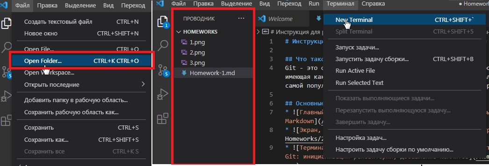
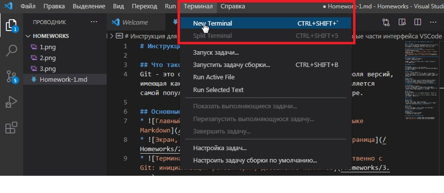
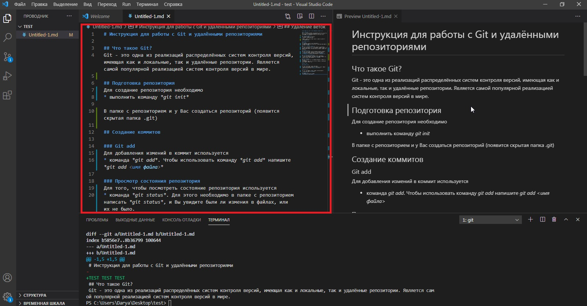
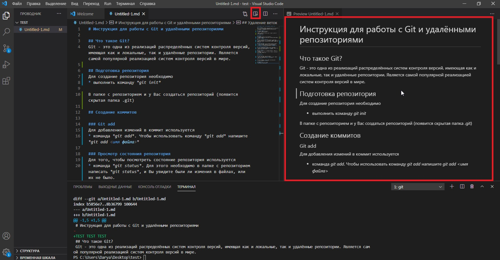
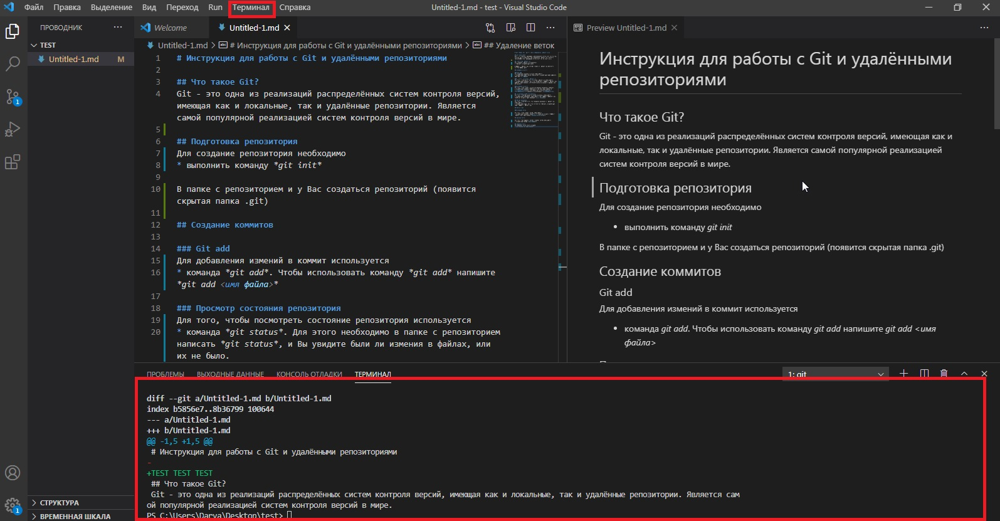

# Инструкция для работы с Git и удалёнными репозиториями

## Что такое Git?
Git - это одна из реализаций распределённых систем контроля версий, имеющая как и локальные, так и удалённые репозитории. Является самой популярной реализацией систем контроля версий в мире.

## Основные части интерфейса VSCode
* Открытие рабочей папки, в которой будут храниться все файлы

* Добавление терминала производится через команду New Terminal

* Главный экран, в котором прописываются команды на языке Markdown

* Экран, в котором отображается как будет выглядеть страница

* Терминал, через который прописходит работа непосредственно с Git

## Подготовка репозитория
Для создание репозитория необходимо   
* выполнить команду *git init*  

В папке с репозиторием и у Вас создаться репозиторий (появится скрытая папка .git)

## Создание коммитов

### Git add
Для добавления измений в коммит используется 
* команда *git add*. Чтобы использовать команду *git add* напишите *git add <имя файла>*

### Git status 
Просмотр состояния репозитория
Для того, чтобы посмотреть состояние репозитория используется 
* команда *git status*. Для этого необходимо в папке с репозиторием написать *git status*, и Вы увидите были ли измения в файлах, или их не было.

### Git commit 
Создание коммитов
Для того, чтобы создать коммит(сохранение) необходимо выполнить 
* команду *git commit*. Выполняется она так: *git commit -m "<сообщение к коммиту>*. Все файлы для коммита должны быть ***ДОБАВЛЕНЫ*** и сообщение к коммиту писать ***ОБЯЗАТЕЛЬНО***.

## Git Checkout
Перемещение между сохранениями
Для того, чтобы перемещаться между коммитами, используется 
* команда *git checkout*. Используется она в папке с пепозиторием следующим образом: *git checkout <номер коммита>*

## Git Log
Журнал изменений
Для того, чтобы посмтреть все сделанные изменения в репозитории, используется  
* команда *git log*. Для этого достаточно выполнить команду *git log* в папке с репозиторием

## Ветки в Git

### Git branch
Создание ветки
Для того, чтобы создать ветку, используется 
* команда *git branch*. Делается это следующим образом в папке с репозиторием: *git branch <название новой ветки>*

## Git merge
Слияние веток
Для того чтобы дабавить ветку в текущую ветку используется 
* команда *git merge <name branch>*

## Git branch -d
Удаление веток
Для удаления ветки ввести команду 
* "git branch -d 'name branch'"

## Полезная команда
Команда для добавления всех файлов и действий 
* *git add .*

## Полезные ссылки и материалы по Git

* [памятка по Git часть 1](https://habr.com/ru/post/541258/)
* [памятка по Git часть 2](https://habr.com/ru/post/542616/)

## Финальное тестирование ветки new_book
*This is some test test test text*
## Тестирование последней ветки new_book
*This is some test text*

## Тестирование картинок

